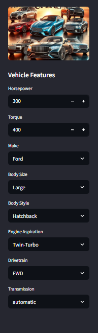

# Car Price Prediction Using Machine Learning

A machine learning project that predicts car prices using Linear Regression with an interactive Streamlit web application.

## 📋 Table of Contents

- [Project Overview](#project-overview)
- [Prerequisites](#prerequisites)
- [Installation](#installation)
- [Project Structure](#project-structure)
- [Running the Project](#running-the-project)
- [Usage](#usage)

## 📊 Project Overview

This project includes:

1. **Data Preprocessing** - Cleaning and preparing car data
2. **Exploratory Data Analysis** - Visualization and correlation analysis
3. **Feature Engineering** - Converting categorical data to numerical format
4. **Model Training** - Linear Regression for price prediction
5. **Web Application** - Streamlit app for real-time predictions

### 🖼️ App Preview



## 🔧 Prerequisites

- **Python 3.8 or higher** - [Download here](https://www.python.org/downloads/)
- **pip** - Python package manager (comes with Python)

## 📦 Installation

### Step 1: Navigate to Project Directory

```bash
cd "Day 5"
```

### Step 2: Create a Virtual Environment (Recommended)

```bash
# On Windows
python -m venv .venv
.\.venv\Scripts\activate

# On macOS/Linux
python3 -m venv .venv
source .venv/bin/activate
```

### Step 3: Install Dependencies

```bash
pip install pandas numpy scikit-learn matplotlib seaborn plotly streamlit openpyxl pillow
```

### Step 4: Verify Installation

```bash
python -c "import pandas; import streamlit; print('Installation successful!')"
```

## 📁 Project Structure

```
Day 5/
├── README.md                          # This file
├── Car Price Prediction.ipynb.ipynb   # Jupyter notebook with full ML pipeline
├── app.py                             # Streamlit web application
├── car_data.xlsx                      # Raw dataset (205 cars)
├── data_with_pred.xlsx                # Data with price predictions
├── linear_model.pkl                   # Trained Linear Regression model
├── feature_importance.xlsx            # Feature importance scores
├── ml_process.png                     # ML process diagram
├── Data Cleaning.png                  # Data cleaning illustration
├── pic 1.PNG                          # Sidebar image
└── pic 2.PNG                          # Banner image
```

## 🚀 Running the Project

### Option 1: Run the Streamlit Web Application

```bash
streamlit run app.py
```

The application will open at `http://localhost:8501` and display:
- **Feature Importance Chart** - Shows which car features most impact pricing
- **Price Prediction Interface** - Interactive form to predict car prices

To stop the application, press `Ctrl+C` in the terminal.

### 🖼️ Application Screenshots


#### Model Results
.png)

### Option 2: Run the Jupyter Notebook

```bash
jupyter notebook "Car Price Prediction.ipynb.ipynb"
```

The notebook contains the complete machine learning pipeline:
- Data loading and preprocessing
- Exploratory data analysis
- Model training and evaluation
- Feature importance analysis

## 💻 Usage

### Using the Streamlit App

1. **Launch the app:**
   ```bash
   streamlit run app.py
   ```

2. **Select vehicle specifications** from the sidebar:
   - Horsepower (0-1000 hp)
   - Torque (0-1500 ft-lbs)
   - Make (Aston Martin, Audi, BMW, Bentley, Ford, Mercedes-Benz, Nissan)
   - Body Size (Compact, Large, Midsize)
   - Body Style (Sedan, SUV, Coupe, Hatchback, Wagon, etc.)
   - Engine Aspiration (Naturally Aspirated, Turbocharged, Twin-Turbo, etc.)
   - Drivetrain (FWD, AWD, RWD, 4WD)
   - Transmission (automatic, manual)

3. **Click "Predict"** to get the estimated car price

#### Example Prediction Flow
.png)

.png)

### Using the Notebook

Run cells sequentially to:
- Load and explore the car dataset
- Clean and preprocess data
- Train the Linear Regression model
- Evaluate model performance
- Generate visualizations

## 📊 Dataset Information

**Source:** car_data.xlsx (205 car records)

**Key Features:**
- Make, Model, Year
- Horsepower, Torque
- Body Style, Engine Aspiration
- Drivetrain, Transmission
- MSRP (price to predict)

## 🔍 Model Information

- **Algorithm:** Linear Regression
- **Train-Test Split:** 80-20
- **Output Files:**
  - `linear_model.pkl` - Trained model for predictions
  - `feature_importance.xlsx` - Top 27 important features
  - `data_with_pred.xlsx` - Dataset with predictions

## 🛠️ Technologies Used

| Technology | Purpose |
|-----------|---------|
| **Python** | Programming language |
| **Pandas** | Data manipulation |
| **Scikit-learn** | Machine learning |
| **Matplotlib/Seaborn** | Visualization |
| **Plotly** | Interactive charts |
| **Streamlit** | Web application |

## ❓ Troubleshooting

### Port 8501 already in use?
```bash
streamlit run app.py --server.port 8502
```

### Missing packages?
```bash
pip install --upgrade pip
pip install pandas numpy scikit-learn matplotlib seaborn plotly streamlit openpyxl pillow
```

### Virtual environment not activating?

**Windows:**
```bash
.\.venv\Scripts\Activate.ps1
```

**macOS/Linux:**
```bash
source .venv/bin/activate
```

### Images not loading in app?
Ensure `pic 1.PNG` and `pic 2.PNG` are in the same directory as `app.py`

---

**Status:** ✅ Ready to Use

**Quick Start:** `streamlit run app.py`
